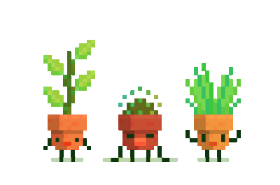

<h4>
    Hello! Welcome to my GitHub profile!
  
</h4> 

✨ I’m Nat, nice to meet you! 
📠I recently graduated in Systems Analysis and Development (: 
👩🏻‍💻 I enjoy programming with Python, HTML, CSS, and JavaScript. I'm delving deeper into Java. 
💾 I also love working with databases, both SQL and NoSQL. 
👥 I'm open to collaborations on new projects! 
👾 Pixel art lover (: 
📠Exploring new technologies and challenges. 
📩 E-mail: nat1998@outlook.com.br 
🔗 Linkedin: https://www.linkedin.com/in/natcardoso/ 

 

  

 

[Potatoes Killer](https://github.com/nataliacrdso/PotatoesKiller) – A simple and fun game that I loved making :D 

<h4 align="center">
     
</h4>

